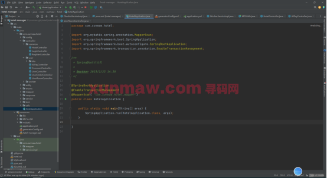
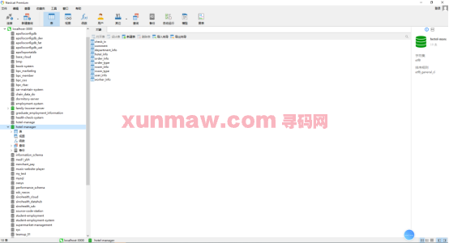
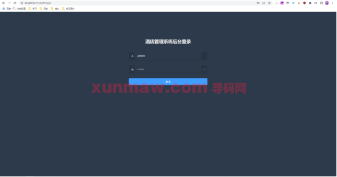
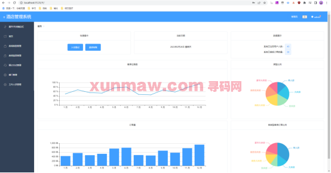
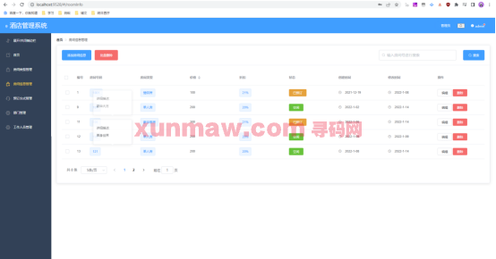
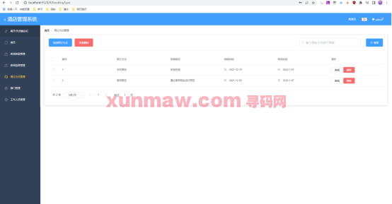
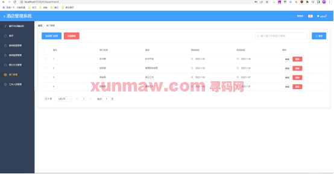
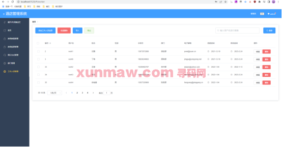

# 毕业设计-酒店管理系统SpringBoot+Vue

#### 介绍
基于springboot+vue实现的酒店管理系统，用于酒店客房业务管理与酒店内部管理。

#### 软件架构
后端：springboot+mybatis  
前端：vue + element-ui  
环境：mysql+maven + node   

#### 功能介绍
##### 【代码结构与数据库截图】

##### 【功能详述】 
△录入账号、密码后登录系统。
商品详情图片

△首页/统计
成功登录系统，显示首页信息，可通过左侧菜单折叠、展开菜单，进入其他功能模块。  
首页展示不同维度的客房统计信息。  

△房间类型管理
用于管理酒店现有的房间类型。房间类型信息包含：类型（即房型名称）、预定价格、预定折扣、房间数（通过房间信息统计所得）、房间面积、图片、有无窗户、床位数量。  
支持添加、编辑、删除、批量删除房型数据。可以通过房间类型搜索数据。  

△房间信息管理
管理酒店现有的客房。一条数据即代表一间客房。维护客房时需要维护房间号码、房间类型、房间状态，价格与折扣通过读取房间类型信息获得。  
支持添加、编辑、删除、批量删除数据。可以通过房间号搜索。  

△预定方式管理
管理客房的预定方式，常见预定方式如手机预定、官网预定等。支持添加、编辑、删除、批量删除预定方式。    

△部门管理
维护酒店部门数据。   

△工作人员管理
管理酒店工作人员，可以添加、编辑、删除、批量导入导出人员数据。管理内容包含用户名、姓名、性别、手机号、部门（从部门管理中读取供选择）、电子邮箱。  

#### 项目预览
地址：[商品详情 ](https://www.xunmaw.com/shop/detail/1631115172203282434)     
点击商品详情中的演示地址，看查看系统录制的视频    

#### 使用说明
1. 创建数据库，执行数据库脚本
2. 修改jdbc数据库连接参数
3. 下载安装maven依赖jar
4. 在tomcat服务器部署项目  
    请求地址： http://localhost:8080/house  
    用户名：admin  
    密码：123456  

#### 联系作者
这是作者的微信二维码，如需本项目源代码，可扫码联系联系作者  

这是作者的公众号二维码，时不时会推一些新开发的项目源码与高效软件工具，感兴趣的朋友给个关注  
